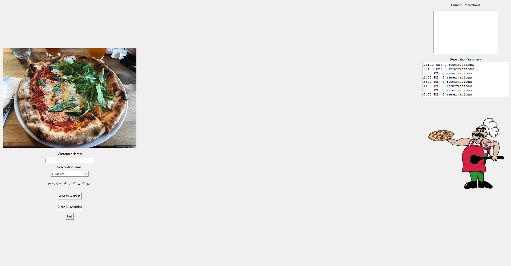

# Pizzeria Reservation System

## Description
This desktop application helps pizzeria staff manage and track reservations by customer name, time slot, and party size. Built using Python and Tkinter, it includes admin controls, reservation analytics, and a funny mascot.

## Features
- Add new reservations with customer name, time, and party size
- View live reservation summary by time slot
- Animated mascot shown in wide/fullscreen view
- Admin-only "Clear All Reservations" (credentials via `.env`)

## Files
- `GUI.py`: Main application with full GUI logic
- `Reservation.py`: Handles reservation class and file I/O
- `Dough-guy.gif`: Mascot animation
- `pizza_logo.png`: GUI branding image
- `.env`: Stores admin credentials (`ADMIN_USERNAME`, `ADMIN_PASSWORD`)
- `README.md`: This documentation

## User Interface


## How to Run
1. Install dependencies:
   ```bash
   pip install pillow python-dotenv
2. Create an .env file to store your chosen admin username and password.
ADMIN_USERNAME=your_username_here

   ADMIN_PASSWORD=your_password_here


